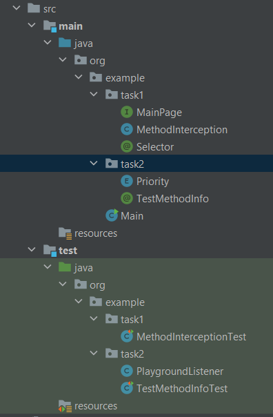

# What has been done?

### Rearranged structure from tasks into separate files



### Task 1

- added logger
- createPage() returns proxy which calls and returns annotation parameter

**Question:** how to create a null-safe response when annotation is not found? I used Optionals, but ony for null response,
because proxy refused to be wrapped in Optionals.

### Task 2

- Created PlaygroundListener.class <- ITestListener
- implemented OnTestStart()
- printed annotation parameters
- connected Listener to the TestClass with annotation
  
**Question 1:** how to correctly gain the list of all annotation parameters?

> I tried to use reflection, but it wasn't successful:

``` java
List<Field> declaredFields = List.of(TestMethodInfo.class.getDeclaredFields());
        for (var field : declaredFields) {
            try {
                System.out.println(field.get(annotation));
            } catch (IllegalAccessException e) {
                throw new RuntimeException(e);
            }
        }
```

**Question 2:** why use ServiceLoader if we need only one instance of Listener and moreover: we can use just annotation?

### What can be done better

- couldn't use ServiceLoader
- working with annotation parameters could be managed better
- safety